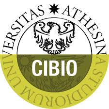

# ‭Master's thesis in quantitative and computational biology

## ‭Exploring the integration of genomic data‬ ‭into stochastic modeling of Cell Cycle

+ Graduant: Andrea Tonina
+ Supervisor : Professor Alessandro Romanel, PhD.

  

_Model annotation_ 

Three types of models based on the positive feedback loops: 
* [Positive feedback loops for both activator and inhibitor](https://github.com/iamandreatonina/master-s_thesis/tree/main/models_thesis/Both_PFB)
* [Positive feedback loop for the activator](https://github.com/iamandreatonina/master-s_thesis/tree/main/models_thesis/PFB_act)
* [Positive feedback loop for the inhibitor](https://github.com/iamandreatonina/master-s_thesis/tree/main/models_thesis/PFB_inhib)

